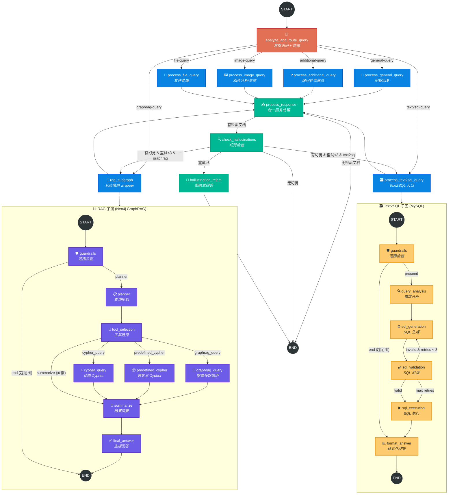

# GustoBot LangGraph 完整工作流（主图 + 子图）

## 节点说明

### 主图节点

| 节点 | 源文件 | 说明 |
|---|---|---|
| `analyze_and_route_query` | `lg_builder.py` | LLM 意图识别，输出 `Router` 结构体，6 种路由类型 |
| `process_general_query` | `lg_builder.py` | 纯 LLM 闲聊回复，不调用外部数据源 |
| `process_additional_query` | `lg_builder.py` | 用户意图模糊时追问补充信息 |
| `rag_subgraph` | `rag_sub_graph/rag_builder.py` | GraphRAG 子图，Neo4j 图谱查询 |
| `process_text2sql_query` | `lg_builder.py` | Text2SQL 子图入口，MySQL 统计查询 |
| `process_image_query` | `lg_builder.py` | 图片分析（视觉模型）或图片生成 |
| `process_file_query` | `lg_builder.py` | 文件上传处理 |
| `process_response` | `lg_builder.py` | 统一回复后处理（answer 提取） |
| `check_hallucinations` | `lg_builder.py` | 幻觉检查：有幻觉且重试<3次 → 回到业务节点重新生成；重试≥3 → 拒绝式回答；无幻觉 → END |
| `hallucination_reject` | `lg_builder.py` | 重试耗尽后生成拒绝式回复，避免输出不可靠内容 |

### RAG 子图节点

| 节点 | 说明 |
|---|---|
| `guardrails` | 范围检查：问题是否属于菜谱领域 |
| `planner` | 查询规划：分析问题需要什么类型的图谱查询 |
| `tool_selection` | 工具选择：动态 Cypher / 预定义 Cypher / GraphRAG 多跳 |
| `cypher_query` | LLM 生成 Cypher 查询并执行 |
| `predefined_cypher` | 匹配预定义 Cypher 模板执行 |
| `graphrag_query` | 图谱多跳遍历 + 知识子图提取 |
| `summarize` | 对查询结果进行摘要压缩 |
| `final_answer` | 生成最终用户回答 |

### Text2SQL 子图节点

| 节点 | 说明 |
|---|---|
| `guardrails` | 范围检查：问题是否适合 SQL 查询 |
| `query_analysis` | 分析用户需求，提取查询意图 |
| `sql_generation` | LLM 生成 SQL 语句 |
| `sql_validation` | 验证 SQL 语法和安全性 |
| `sql_execution` | 执行 SQL 并获取结果 |
| `format_answer` | 将查询结果格式化为用户友好的回答 |
